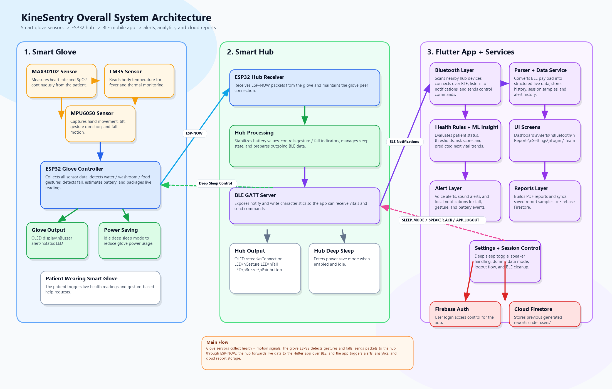

# KineSentry

KineSentry is a smart patient-monitoring system built around a wearable glove,
an ESP32 hub, and a Flutter application. It captures vital signs and motion,
streams them to the app in real time, triggers alerts, generates reports, and
stores report snapshots in Firebase.

This repository is a sanitized GitHub-ready backup of the codebase. Sensitive
Firebase values and other local secrets have been replaced with placeholders so
you can safely upload the source and restore the real config later when needed.

## App Glance and Demo

https://github.com/user-attachments/assets/09d87c92-a85d-4d30-bcd0-5f1786fe9905

 - View Overall Demonstration here : [https://www.youtube.com/watch?v=uDa3mpUsaw0](https://youtu.be/Q-GPc6-O0EY?si=uJSF82TzNpjaYWdx)


## Highlights


- Live monitoring of heart rate, SpO2, temperature, gestures, falls, and battery
- ESP-NOW communication between glove and hub
- BLE communication between hub and Flutter app
- Alert pipeline with in-app feedback, sound, voice, and notifications
- Session, hourly, and daily reporting
- PDF report generation and Firestore report storage
- Settings for dark mode, dummy data, deep sleep, speaker routing, and alerts

## Architecture



The diagram above represents the complete operating flow:

1. Sensors on the glove capture body data and motion.
2. The ESP32 glove controller packages that information.
3. The hub receives it over ESP-NOW and exposes it to the app over BLE.
4. The Flutter app parses, analyzes, displays, alerts, and stores report data.
5. Firebase Auth and Firestore support login and report persistence.
6. Phone and OS services handle notifications, text-to-speech, audio playback, PDF viewing, and preferences.

## System Breakdown

### 1. Smart Glove Device

The glove is the patient-side hardware layer.

- `MAX30102`: heart rate and SpO2 sensor
- `LM35`: body temperature sensor
- `MPU6050`: motion, tilt, and fall-detection sensor
- `ESP32 glove controller`: reads the sensors, detects gesture and fall events, calculates battery state, and prepares outgoing packets
- local outputs: OLED display, buzzer, and status LEDs
- power management: deep sleep handling

The glove firmware source is included in:

- [`hardware/esp32_glove_final.txt`](hardware/esp32_glove_final.txt)

### 2. Smart Hub Device

The hub sits between the glove and the app.

- receives glove packets over ESP-NOW
- smooths or validates incoming values
- monitors device connection state
- exposes the current state over BLE GATT
- receives app commands such as sleep mode or logout flow
- drives local indicators such as display, LEDs, buzzer, and pair button

The hub firmware source is included in:

- [`hardware/esp32_hub_final.txt`](hardware/esp32_hub_final.txt)

### 3. Flutter Mobile / Desktop App

The Flutter app is the main user-facing layer. It handles:

- BLE scan, connect, listen, and write commands
- payload parsing and state storage
- live dashboard rendering
- alert history and status evaluation
- ML-style insight generation
- report generation and PDF preview/share
- settings and session control

Important app areas:

- [`lib/screens/`](lib/screens)
- [`lib/services/`](lib/services)
- [`lib/widgets/`](lib/widgets)
- [`lib/theme/`](lib/theme)

### 4. Cloud Backend

Firebase is used for:

- authentication
- report persistence in Firestore under `users/{uid}/reports`

This repo does not contain live Firebase credentials anymore. Placeholder
config is provided instead.

### 5. Platform / OS Services

KineSentry also relies on platform services for:

- local notifications
- text-to-speech
- sound playback
- PDF preview and share
- SharedPreferences
- external Bluetooth audio routing

## Data Flow

### Sensor Data Flow

`Sensors -> ESP32 Glove -> ESP-NOW -> ESP32 Hub -> BLE -> Flutter Parser -> DataService -> UI / Alerts / Reports / ML`

### Command Flow

`Flutter Settings / Session Control -> BLE Write -> Hub -> Hub Control / Deep Sleep / Speaker Acknowledgement`

### Report Flow

`Live Samples -> Report Generation -> PDF Build -> Firestore Save -> Report Reopen / Share`

## App Layers

### Bluetooth Communication Layer

Responsible for:

- scanning nearby devices
- connecting to the ESP32 hub
- listening to BLE notifications
- sending commands like sleep mode and app logout

Main files:

- [`lib/services/bluetooth_service.dart`](lib/services/bluetooth_service.dart)
- [`lib/screens/bluetooth_screen.dart`](lib/screens/bluetooth_screen.dart)

### Parser + Data Service

Responsible for:

- parsing BLE payload strings
- normalizing sensor values
- storing latest values
- keeping session and history data
- maintaining alert history

Main files:

- [`lib/services/parser.dart`](lib/services/parser.dart)
- [`lib/services/data_service.dart`](lib/services/data_service.dart)

### Alert Layer

Responsible for:

- immediate in-app feedback
- sound alerts
- voice alerts
- local notifications
- synchronization with settings toggles

Main files:

- [`lib/services/alert_service.dart`](lib/services/alert_service.dart)
- [`lib/services/sound_service.dart`](lib/services/sound_service.dart)
- [`lib/services/voice_service.dart`](lib/services/voice_service.dart)
- [`lib/widgets/alert_feedback_host.dart`](lib/widgets/alert_feedback_host.dart)

### Health Rules + ML Insights

Responsible for:

- evaluating status from vital thresholds
- identifying warning and critical states
- generating risk-oriented trend summaries

Main files:

- [`lib/services/health_rules.dart`](lib/services/health_rules.dart)
- [`lib/services/ml_insight_service.dart`](lib/services/ml_insight_service.dart)

### Reports Layer

Responsible for:

- session, hourly, and daily report preparation
- averages and graph-ready data
- PDF report generation
- Firestore save/load/delete support

Main files:

- [`lib/screens/reports_screen.dart`](lib/screens/reports_screen.dart)
- [`lib/services/pdf_service.dart`](lib/services/pdf_service.dart)
- [`lib/services/report_storage_service.dart`](lib/services/report_storage_service.dart)

### UI Screens

Screens currently included:

- dashboard
- alerts
- Bluetooth
- reports
- settings
- login
- splash
- team

## Repository Structure

```text
lib/
  screens/              Flutter UI screens
  services/             BLE, alerts, auth, parsing, reports, ML, session control
  widgets/              shared UI components and graphs
  theme/                app theme and visual system

hardware/
  esp32_glove_final.txt firmware source for glove controller
  esp32_hub_final.txt   firmware source for hub controller

docs/
  kinesentry_architecture.png
  overall_architecture.md
```

## Security / Sanitization Status

The following files were sanitized and now contain placeholders or comments:

- [`android/app/google-services.json`](android/app/google-services.json)
- [`lib/firebase_options.dart`](lib/firebase_options.dart)
- [`firebase.json`](firebase.json)
- [`lib/services/auth_service.dart`](lib/services/auth_service.dart)

The following local secret/signing file patterns are ignored in Git:

- `android/key.properties`
- `*.jks`
- `*.keystore`
- `.env`
- `.env.*`
- `ios/Runner/GoogleService-Info.plist`
- `macos/Runner/GoogleService-Info.plist`
- `android/local.properties`

## Restore Checklist

Before running this project again on another machine:

1. Install Flutter SDK.
2. Install Android Studio.
3. Clone the repository.
4. Run:

```powershell
flutter pub get
```

5. Restore the real Firebase Android config:
   Replace [`android/app/google-services.json`](android/app/google-services.json)
   with the real file downloaded from Firebase.
6. Restore FlutterFire options:
   Either run `flutterfire configure` or replace
   [`lib/firebase_options.dart`](lib/firebase_options.dart) with your real values.
7. If you want restricted email login again:
   Either edit [`lib/services/auth_service.dart`](lib/services/auth_service.dart)
   or pass:

```powershell
flutter run --dart-define=KINESENTRY_FIREBASE_EMAIL=your@email.com
```

8. If you need release signing:
   Restore your keystore and `android/key.properties`.
9. Run:

```powershell
flutter run
```

## GitHub Upload Steps

If this folder is not already a git repo:

```powershell
git init
git add .
git commit -m "Sanitized KineSentry codebase backup"
```

Create an empty repository on GitHub, then connect and push:

```powershell
git remote add origin https://github.com/YOUR_USERNAME/YOUR_REPOSITORY.git
git branch -M main
git push -u origin main
```


- The project includes both application code and hardware firmware sources.
- The sanitized files are intentionally not runnable until you restore your real config.
- This repository is designed to be a long-term safe backup of the KineSentry source code.
