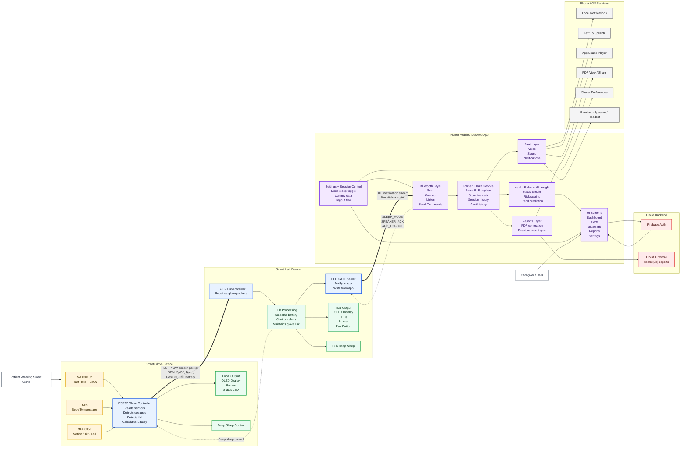

# KineSentry Overall Architecture

This diagram captures the implemented end-to-end architecture across the wearable glove, the hub, the Flutter app, and its cloud/local service dependencies.

## Notes

- Primary live data path: `Glove sensors -> ESP-NOW -> Hub -> BLE -> Parser -> DataService -> Dashboard / Alerts / Reports / ML`.
- Primary control path: `Settings / Session actions in app -> BLE write commands -> Hub -> ESP-NOW control -> Glove`.
- Reports are regenerated in-app from Firestore samples and then viewed/shared as PDFs.
- The current BLE payload generated by the hub includes `speaker` and `sleep`. The Bluetooth screen also checks for `speaker_request`, which does not appear in the current hub payload and may represent an integration gap.
